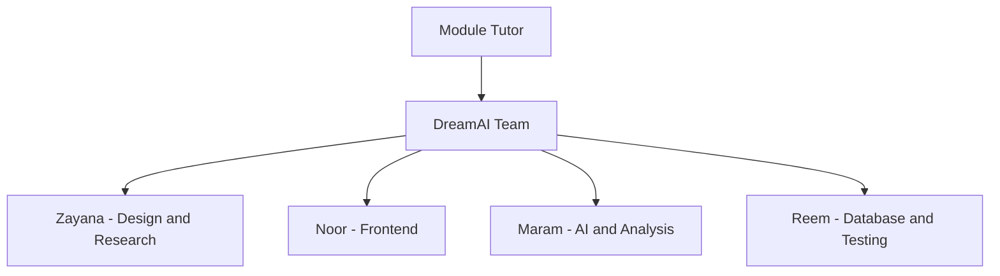
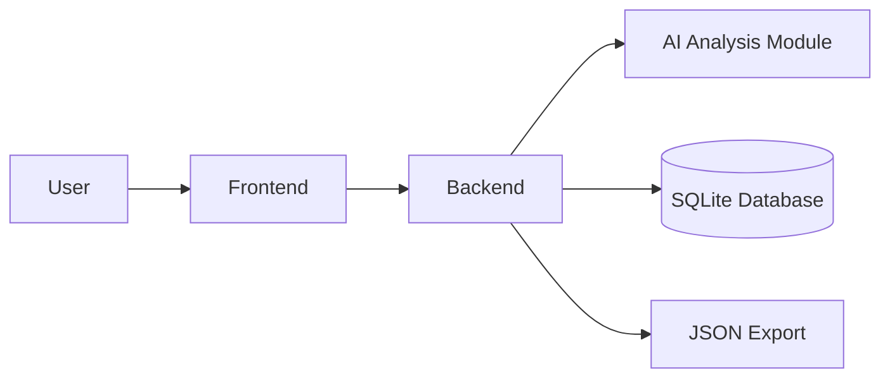

# DreamAI Project Management Pack

## 1. Project Summary

### Project title
AI-Based Dream Analysis System

### Aim
To design and develop an AI-based system that helps users record and analyse their dreams in order to understand emotional states and recurring dream patterns.

### Core problem
Students often experience stress, anxiety, and poor sleep, but common wellness tools rarely connect dream content to emotional trends.

### Proposed solution
DreamAI provides secure dream journaling, AI-based emotional analysis, recurring-pattern detection, dashboard visualisation, and exportable user data.

## 2. Stakeholder Register

| Stakeholder | Interest | Influence | Need from project |
|---|---|---:|---|
| Students / end users | High | High | Easy-to-use dream recording and understandable insights |
| Project team | High | High | Clear scope, division of work, and deliverable completion |
| Module tutors | High | High | A complete, working, assessable artefact with documentation |
| University | Medium | Medium | Ethical, safe, and academically sound project work |
| Future employers / reviewers | Medium | Medium | Evidence of technical, teamwork, and documentation skills |
| Mental health professionals | Low | Low | Clear disclaimer that the tool is not a diagnostic system |

## 3. Intended Target Audience

- university students
- users interested in dream journaling and emotional reflection
- academic assessors evaluating design, implementation, and teamwork

## 4. Functional Requirements

1. Users shall be able to register and log in securely.
2. Users shall be able to record dreams using text input.
3. Users shall be able to use voice input in supported browsers.
4. The system shall analyse dream text and estimate emotional tone.
5. The system shall detect recurring words and symbols across dream entries.
6. The system shall store user dreams and analysis results in a database.
7. The system shall display charts and trend summaries in a dashboard.
8. The system shall allow users to review and delete previous entries.
9. The system shall allow users to export stored dream data.

## 5. Non-Functional Requirements

- The UI should be easy to use on desktop and mobile browsers.
- The system should preserve user privacy and avoid storing plain-text passwords.
- The application should handle missing AI dependencies gracefully where possible.
- The first usable local setup should be simple enough for a student demonstration.
- The system should provide clear disclaimers that outputs are not medical advice.

## 6. Implementation Environment

- Backend: Python, Flask, Flask-SQLAlchemy
- Database: SQLite
- Frontend: HTML, CSS, JavaScript
- AI/NLP: Hugging Face Transformers, scikit-learn, optional NLP packages
- Visualisation: Chart.js
- Browser target: Chrome recommended
- Local operating system target: Windows laptop/desktop

## 7. Software Tools and Hardware

### Software tools

| Tool | Purpose |
|---|---|
| Python 3.10/3.11 | Core application runtime |
| Flask | Web backend |
| SQLAlchemy | Database ORM |
| Chart.js | Dashboard charts |
| Transformers | Emotion classifier |
| scikit-learn | Pattern and keyword extraction |
| Git | Version control |
| VS Code / IDE | Development |

### Hardware requirements

| Item | Purpose | Estimated cost (OMR) |
|---|---|---:|
| Student laptop | Development and demo | 0.000 existing resource |
| Microphone / headset | Voice-input testing | 8.000 |
| Internet connection | Package and model download | 0.000 existing resource |
| Optional external storage | Backup and report files | 10.000 |

## 8. Cost Breakdown and Budget

### Software cost

| Item | Cost (OMR) |
|---|---:|
| Python | 0.000 |
| Flask and open-source libraries | 0.000 |
| Chart.js | 0.000 |
| Git / GitHub basic usage | 0.000 |

### Hardware and operational cost

| Item | Cost (OMR) |
|---|---:|
| Headset / microphone | 8.000 |
| Optional USB storage | 10.000 |
| Printing and presentation material | 7.000 |
| Contingency | 10.000 |

### Estimated total project budget

`35.000 OMR`

## 9. Feasibility Study

### Technical feasibility
High. The project uses widely available web and NLP technologies that are realistic for a student project.

### Operational feasibility
High. End users only need a browser and a local demo instance.

### Economic feasibility
High. Most tooling is free and open source, with minimal optional hardware cost.

### Schedule feasibility
Moderate to high. The feature set is manageable when split across four students.

## 10. Project Lifecycle Choice

### Selected lifecycle
Iterative Agile-style development

### Justification

- the project combines UI, backend, database, and AI integration
- parts can be built and tested incrementally
- voice input, model integration, and dashboard reporting benefit from repeated refinement
- frequent check-ins support teamwork and academic deadlines

## 11. Team Organisation

### Role allocation

| Team member | Responsibility |
|---|---|
| Zayana | system design, research, architecture, documentation support |
| Noor | UI, frontend, dashboard, responsiveness |
| Maram | AI model selection, emotion analysis, keyword/pattern logic |
| Reem | database design, testing, storage, validation |

### Organisation diagram



### Software development diagram



## 12. Risk Register

| ID | Risk | Category | Impact | Likelihood | Mitigation |
|---|---|---|---|---|---|
| R1 | Flask dependencies not installed on demo machine | Technical | High | Medium | Provide setup instructions and requirements file |
| R2 | Transformer model download is slow or blocked | Technical | High | Medium | Keep rule-based fallback and demo seed data |
| R3 | Browser blocks voice recognition | Technical | Medium | Medium | Recommend Chrome and allow text-only use |
| R4 | Database path issues break local execution | Technical | High | Medium | Use absolute path handling |
| R5 | Password storage is insecure | Product | High | Low | Use salted hashed password storage |
| R6 | Users misunderstand AI output as diagnosis | Safety | High | Medium | Show non-medical disclaimer in UI and docs |
| R7 | Team members have merge conflicts or duplicated work | Project | Medium | Medium | Clear ownership and iterative integration |
| R8 | Project documentation is incomplete | Project | High | Medium | Maintain repo-based documentation pack |
| R9 | Charts or frontend layout fail on mobile | Product | Medium | Medium | Keep responsive CSS and test smaller screens |
| R10 | Session/login issues occur when opening HTML directly | Technical | Medium | High | Recommend Flask-served launch workflow |
| R11 | Sensitive dream data is exposed casually | Business | High | Low | Use local SQLite, user sessions, and no plain-text passwords |
| R12 | Pattern detection produces weak results for small datasets | Product | Medium | Medium | Use fallbacks and explain minimum data needs |
| R13 | Team misses assessment deadlines | Project | High | Medium | Keep milestone chart and role-specific plans |
| R14 | Demo fails because seeded data is missing | Project | High | Medium | Initialise database with demo account and sample dreams |
| R15 | Limited dataset lowers AI accuracy | Product | Medium | High | Position tool as reflective support, not diagnosis |
| R16 | Export feature missing for report evidence | Product | Medium | Medium | Provide JSON export from dashboard |
| R17 | Poor referencing or weak report structure reduces marks | Project | High | Medium | Use final report outline and alignment doc |
| R18 | User enters extremely long or invalid dream text | Product | Medium | Medium | Enforce validation limits |
| R19 | Demo laptop lacks microphone | Operational | Low | Medium | Keep text input as primary method |
| R20 | Unexpected package incompatibility with Python version | Technical | Medium | Medium | Recommend Python 3.10 or 3.11 |

## 13. Societal, Risk, Safety and Health Implications

### Societal impact

- encourages self-reflection and emotional awareness
- may support students in noticing stress patterns
- demonstrates responsible use of AI for wellbeing support

### Safety and health considerations

- outputs must not be presented as professional mental-health advice
- the tool must clearly advise users to seek professional support for serious issues
- privacy matters because dream entries may include sensitive personal content

### Ethical position

- DreamAI is a reflective assistant, not a diagnostic engine
- transparency and disclaimers are required in the UI and documentation

## 14. Need Analysis and Market Study

### Market gap

Most student-focused wellbeing applications cover mood tracking, meditation, study planning, or productivity. Very few connect dream content with emotional monitoring and recurring-symbol analysis.

### Why the idea has market potential

- students commonly experience stress and irregular sleep
- dream journaling is already familiar in self-help and wellness spaces
- a lightweight AI explanation layer makes the journal more engaging
- the system can evolve into a wider wellbeing platform

### Potential future expansion

- mood journaling
- sleep-tracking integration
- reminders and wellness suggestions
- weekly summary reports

## 15. Project Planning and Milestones

| Milestone | Planned completion |
|---|---|
| Requirements definition | 03 March 2026 |
| Literature review | 07 March 2026 |
| Sample data collection | 10 March 2026 |
| Architecture design | 14 March 2026 |
| UI design | 20 March 2026 |
| Text input feature | 25 March 2026 |
| Voice input feature | 30 March 2026 |
| Emotion detection model | 05 April 2026 |
| Recurring symbol detection | 12 April 2026 |
| Database structure | 18 April 2026 |
| Database integration | 22 April 2026 |
| AI and UI integration | 28 April 2026 |
| Testing | 05 May 2026 |
| Debugging and improvement | 12 May 2026 |
| Final documentation | 22 May 2026 |
| Final demonstration | 31 May 2026 |

## 16. Simplified Gantt View

```text
March 2026
| Req | Review | Data | Architecture | UI | Text Input | Voice |

April 2026
| Emotion Model | Pattern Detection | DB Design | DB Integration | AI Integration |

May 2026
| Testing | Debugging | Analysis | Documentation | Presentation | Demo |
```

## 17. Limitations

- model accuracy depends on available pretrained resources
- small datasets reduce recurring-pattern quality
- voice input support is browser-dependent
- current version is local/demo-focused rather than cloud deployed

## 18. Commercialisation Overview

### Positioning
DreamAI can be positioned as a student wellbeing reflection tool.

### Possible revenue model

- freemium journaling app
- premium weekly reports and deeper insights
- partnerships with universities or student support services

### Marketing ideas

- student wellbeing campaigns
- university showcase events
- app-demo videos and presentation pitches
- social-media awareness content focused on sleep and stress reflection
